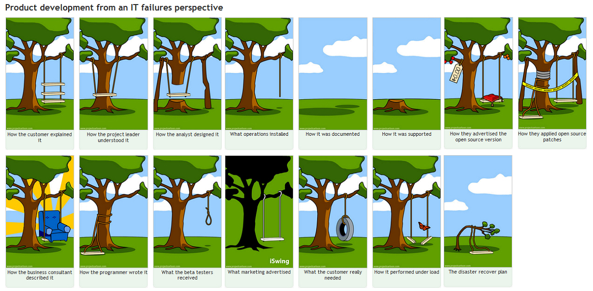

# Projectwerk 2

This project is organized for the Projectwork 2 course. Guidelines and information needed by the students enrolled in the course is found here.

* [Project description](./description)
  * [Controller](./description/controller.md)
  * [API](./description/api.md)
  * [Game](./description/game.md)
  * [Scoreboard](./description/scoreboard.md)
* [Project requirements](./requirements)
  * [Hardware](./requirements/hardware.md)
  * [Firmware](./requirements/firmware.md)
  * [Software](./requirements/software.md)
  * [Minimum requirements](./requirements/minimum-requirements.md)
  * [Collaboration](./requirements/collaboration.md)
* [Report](./report)
* [Presentation](./presentation)
* [Roadmap](./roadmap)

## Final notes

> "De enige plaats waar succes voor werk komt, is het woordenboek." \[Vidal Sassoon\] or in English "The only place where success comes before work, is in the dictionary.

<!-- How to split these lines? -->

> "Een expert is iemand die binnen een beperkt vakgebied alle mogelijke fouten heeft gemaakt."
> or in English "An expert is someone who made every mistake within his professional discipline.

As a matter of fact, your team should always avoid product development disasters, as presented in the following picture:

