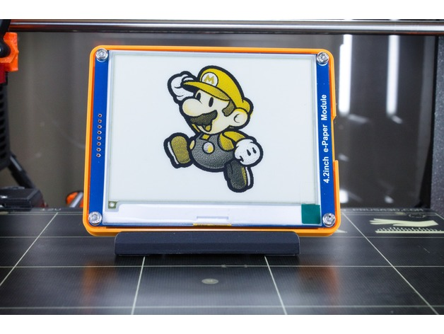
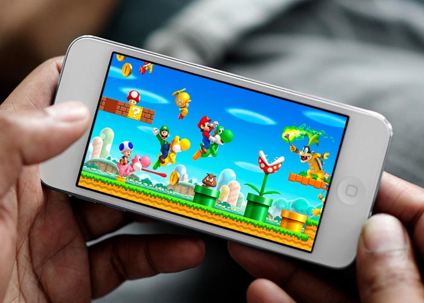

# Project description

Many game consoles exist. They all focus on graphics and expensive hardware. Most of them are not portable. They are big and heavy. Only some of them are really mobile. But even then batteries don't last that long. With this project, we would like to tackle these problems, and make a gaming console that is very low power, so low power that batteries would never be your concern.

It is only recently that new technologies have come available that make real low power applications feasible. Not many of these technologies are used with game consoles. Lets change this and apply them to make a difference.

## Power Consumption

Console | Watts
 --- | ---
Nintendo Switch | 10-18
PS4 Pro | 75-160*
PS4 Slim | 55-110
PS4 | 90-150
Xbox One X | 65-180*
Xbox One S | 35-90
Xbox One | 70-120
Wii U | 35
PS3 Slim | 85
PS3 Original | 190
Xbox 360 S | 90
Xbox 360 |  Original180
Wii | 40

[source: energyusecalculator.com](http://energyusecalculator.com/electricity_gameconsole.htm)

When taking a look at the table above, we can see that game consoles use a lot of power. Even the portable ones. The Nintendo Switch uses between 10 to 15 Watts of power. This is enough to make it last a couple of hours on batteries before you need to recharge it.

## Making a Difference

To save power we could use some interesting technologies to make sure you never need to worry about batteries again.

We need to experiment with what is possible, but some technologies enable to think in milliWatts instead of Watts. Are we able to solve this problem with a power consumption below 10mW? This would mean that our console is 1000 times more energy efficient than the Nintendo Switch.

### LoRaWAN

LoRaWAN is a low power wireless communication technology. It enables you to communicate over great distances (20-40 km in good conditions). It uses almost no power to achieve this. LoRaWAN is an IoT (Internet of Things) technology that enables sensors to measure and send values to the cloud with batteries that last for over than 10 years. This makes LoRaWAN the ideal wireless communication protocol for our game console.

### E-Ink display

E-Ink or E-Paper is a display technology that only uses power when changing the image you want to display. This means that it is very low power. When the image does not need to change, it effectively uses 0 Watts. You can even decouple the power and the image will still persist for eternity.

An low power design would not be possible with even some leds to give feedback, so another solution must be found. Our controller could use E-Paper display to give some feedback to the user. It does not need to show much, but feedback is definitely a welcoming feature.

### Capacitive Touch

Capacitive touch is widely used nowadays in touch screens and other devices. From a hardware perspective it is even cheap, as you do not need add any costly mechanical components. Just a small chip and some space on a PCB for the pads.

### Browser Based Gaming

Another important feature for our gaming console is portability. Smooth and awesome graphics on a custom hardware console would be very difficult. Look at the consoles that are already available. To solve this, we could ditch the console itself entirely.

If we host the games and applications for the controller in the cloud, then there is no extra hardware needed and power problem will not even exist. By supporting browser based games and applications the portability problem is solved as well. Using the browser, means that people can play on their smartphones, PC's, TV's, or any device that has access to the internet. If you are playing on your PC and need to go outside, just switch to your phone, while still making use of a game controller you can hold in your hands. This ability makes our console truly portable.

### Gaming Platform

Instead of making a dedicated console or controller we could even go a step further. We could create a platform allowing anybody to build their own games and solutions. To allow this, we could create a publicly accessible API that provides information about the controller without knowing how it works. Without knowledge of the hardware, anybody is able to access the information and use it for whatever they want.

* [Controller](./controller.md)
* [API](./api.md)
* [Game](./game.md)
* [Scoreboard](./scoreboard.md)