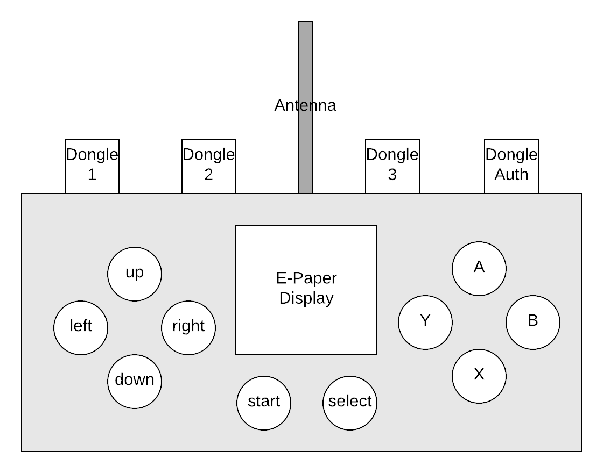
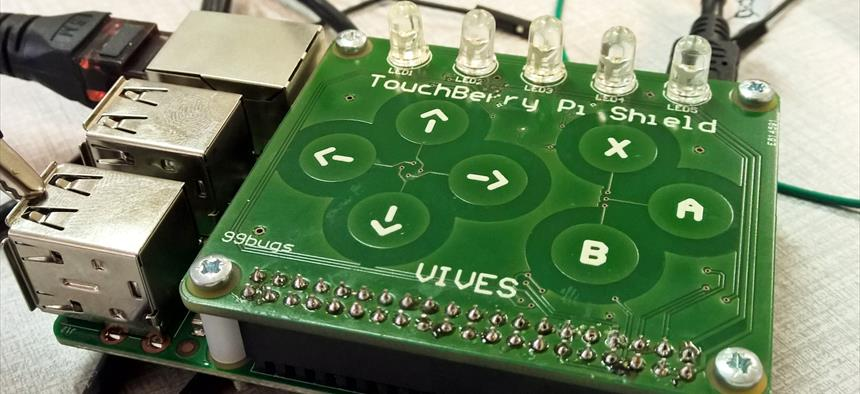
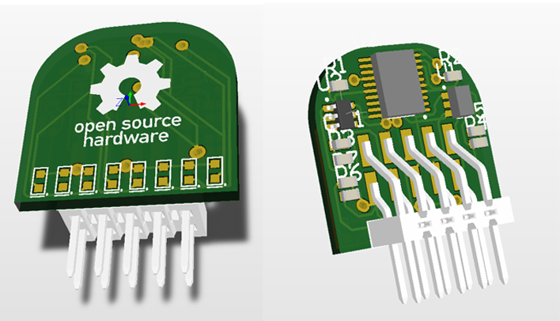
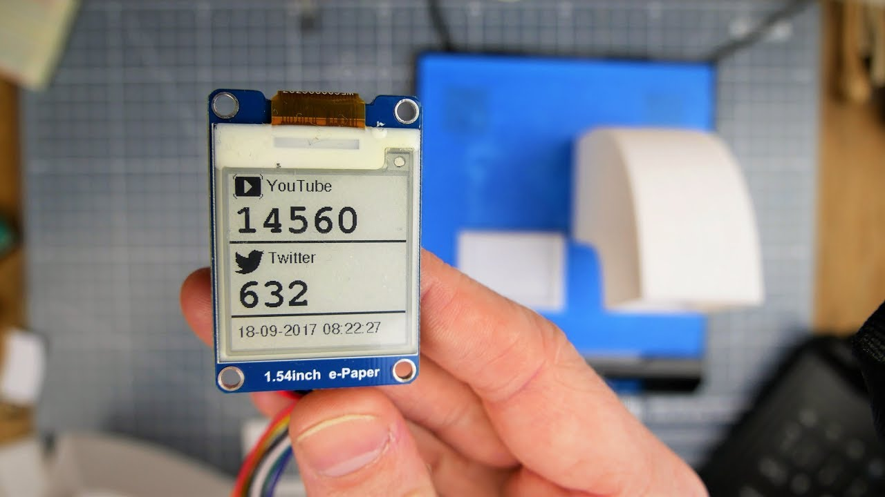
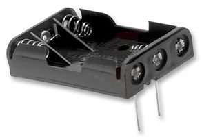

# Controller

The controller could be build like on the sketch below. 

## Capacitive touch 

The controller could be build without any hardware for the controls. This could be solved using capacitive touch. In this way, you don't need any physical hardware, (many buttons are way to small to interface directly and are uncomfortable). Capacitive touch pads only require some space on a PCB.

An example can be found on the [Touchberry Pi controller](https://circuitmaker.com/Projects/Details/Sille-Van-Landschoot-2/TouchBerry-Pi). All the sources of this design are open source on [circuitmaker.com ](https://circuitmaker.com/Projects/Details/Sille-Van-Landschoot-2/TouchBerry-Pi).

The touchberry Pi shield could even be used for protoyping. No extra hardware is required as they use a simple QT1070 chip that you can communicate with using I²C. More information could be found in the [datasheet](https://ww1.microchip.com/downloads/en/DeviceDoc/Atmel-9596-AT42-QTouch-BSW-AT42QT1070_Datasheet.pdf)

One thing to remember is that the QT1070 does not support multitouch. So care need to be taken in the design and how to make practical use of it. None the less this won't prevent you to do some cool stuff with it.

Note: The STM32 microcontroller supports capacitive touch out of the box as wel. At the moment, no proof of concept or example as available. It will need some work and datasheet diving to get it working on mbed. Maybe not easy but definetly possible.

## LoRaWAN communication

To make a wireless controller we need a means of wireless communication. Wifi is not low-power enough, and Bluetooth needs an extra receiver close by. 

LoRaWAN is low power and does not necessarily needs any receiver close by. It makes a great technology to make our controller wireless.

LoRaWAN has some limitation, but this does not mean it will prevent us from doing some cool stuff with it. This project will prove it otherwise.

## Smart Dongles

The controller could be made extensible by adding some (3 or 4) slots to add some dongles. The dongles are provisioned with a small EEPROM chip that contains data or and identifier. Using I²C, the dongles could be read at startup and unlock functionality.

One of the dongles could be used to identify yourself to the controller. Anybody could get a peronal (keychain) dongle. If you would like to play with any controller you just need to insert your personal dongle, and the game knows who you are. 

Some dongles could have some LED's on them to display status. Or could we add another capacitive touch button to add some extra features?

### Choose your weapons !

The dongles could have specific functions. Some dongles could act as weapons, other will help you defend or will give an energy boost. Some examples are:

* Weapons
  * Flammenwerfers
  * Lasers
  * Mines
  * Plasma guns
  * EMP bombs
* Defence
  * Shields
  * Turrets
* Boosters
  * Ram
  * Range extender
  * Airlifts
  * Harriers

Depending on the dongles you insert in your controller you could make your personal bot.

## E-paper display

In the center, an E-Paper display could be placed to give feedback to the user. It could display different kinds of information:

* the life
* types of extensions (dongles)
* battery status
* the name of the authenticated player
* bullets fired / bullets left
* energy level

## Battery powered

