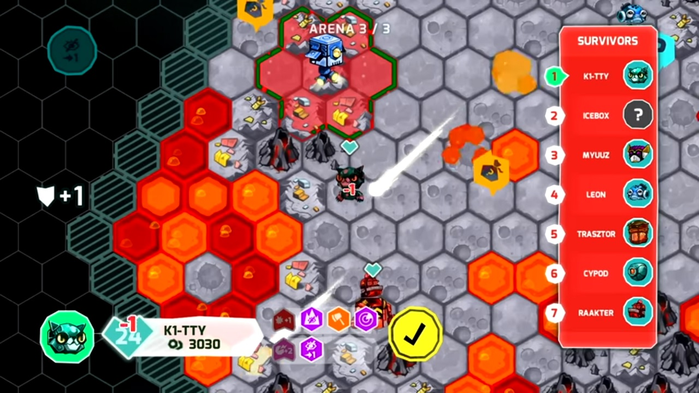
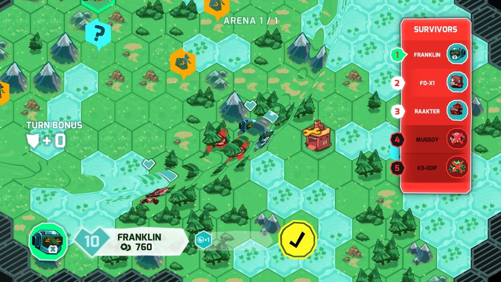
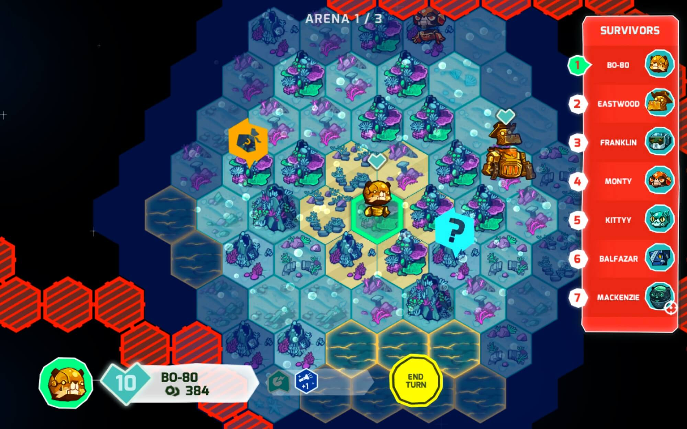

# Game

Using LoRaWAN for the controller introduces some limitations that we need to take into account. For example, we are only able to transmit data every 3 to 5 seconds. We won't see these consequences as limitations, but rather as challenges.

To build a game using these challenges, we need to add some features to the game. For instance we are able to build a **turn-based**, slow-speed game. This type of game has proven to be fun and effective. Examples are Worms and Civilization. Having slower communication does not imply a boring game. Being creative here is key.

The idea is to build a top-down game that makes use of 'hexes' to navigate through the map. Players are able to take over a 'bot' using their controller. Each player can play some actions during his turn. A turn could have a time-out of 20 seconds. In your turn you could choose to move, rotate or fire at the enemies.

You can use weapons like Flammenwerfers, Lasers, Mines, Plasma guns, EMP bombs and many more. Players can choose to fortify their bots using armor, or could choose to increase health. All these options will be chosen using the dongles that can be attached to the controller.

## Browser Based

To be portable and be able to let everyone enjoy the game, it would be a good idea to build a browser based game using Phaser. Browser based games are ultra portable. You can play on your smartphone in the car, or on your 8K display at your desk, or maybe even on your smartwatch.

Some inspiration could be Insane Robots:

## Game Mechanics

Every game needs some game mechanics. They are the rules that govern the world of that game and the players in it. They also determine the abilities and stats of your entities in the game.

The sections below document a brief selection of basic mechanics for the tank game. 

### Turn

* 2 actions
  * Move
  * Fire
* If hit (in range) subtract (damage- applied Armor Points) from Health Points

### Stats

* Movement
  * Move = hexes per turn
    * Rear is directed to origin hex after movement has ended
  * Rotate stationary
    * Costs 1 move, stay in hex
  * Ramming: when moving into an occupied hex both bots get 5 damage
* Health
  * Health points: 0 HP = disabled
* Armor
  * Armor points
  * Front / side /rear
* Weapon
  * 1 fire action per weapon per turn
  * Specials
  * Range - Line of Sight (LoS) weapons mounted at front
  * Damage

### Standard bot

* Movement: 2
* HP: 20
* AP Front: 3, Side: 2, Rear: 1
* Weapons: gatling gun
  * Range: line LoS 20 hexes
  * Damage: 4

### Booster Items and Weapons

* Movement
  * Rocket engine: movement +3
  * Amphibious: may enter water
  * Harrier: jump 6 hexes once every 3 turns, can only jump into clear terrain, ignores terrain in between
* Armor
  * Adamantium: 1 side AP +3, movement -1
  * Gravy shield: each turn, choose side AP +1
* Health
  * Nanobots: regenerate 2 HP once every 3 turns (max. original health)
  * Structural strengthening: HP +5
* Weapon
  * Flammenwerpfer
    * Range: line LoS 3 hexes
    * Damage: 8
    * Special: BURN BURN BURN: next turn 5 damage
  * Laser
    * Range: line LoS unlimited
    * Damage: 3
  * Mines (5)
    * Bury 1 mine on a hex
    * When a bot enters a hex, mine deals 10 damage, discard mine afterwards
  * Plasma gun
    * Range: 90 degrees max. 3 hexes
    * Damage: 6
    * Special: ignores AP
  * EMP bomb
    * Range: all adjacent hexes
    * Special: Disable 1 item for the next turn, mines are also disabled
  * Ram
    * Range: none
    * Damage: ramming damage +3

### Terrain

* Clear
* Obstacle: cannot enter hex, blocks LoS
* Water: cannot enter hex
* Fortification: all AP +1
* Possible fog of war