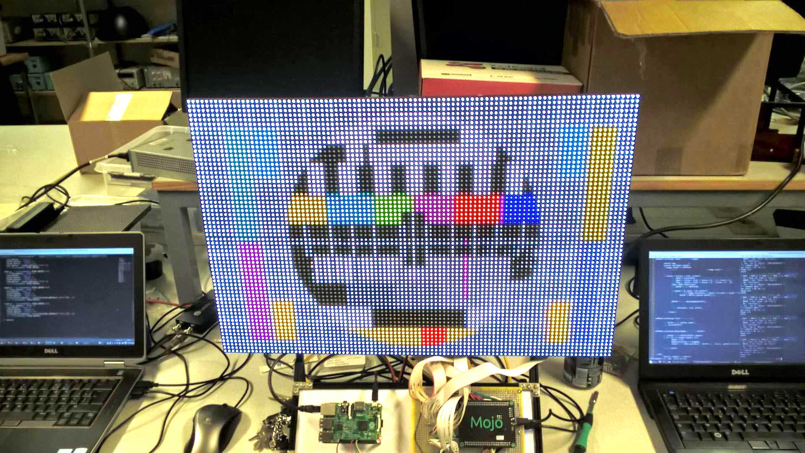
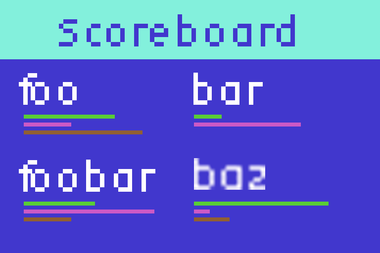

# Scoreboard

The "Meme Machine" LED TV can both be used as a score board and match status display, showing all sorts of information about the current game.

It could display the following information:

* match name
* match duration
* player names
* player stats (eg: progress bars)
  * health
  * power
  * bullets left
  * shots fired
* ranking
* minimap
* matches played
* ...

Example:

Different stats can be displayed using different screens that rotate automatically.

## Technical Details

The meme machine consists of a Mojo FPGA that is connected via SPI with a Raspberry Pi. The FGPA drives the 6 LED panels, for a total of 6'144 RGB LEDs.

The Raspberry Pi serves a webinterface which is accessible on port 80 to easily upload images or display a text on the LED TV. However, in his case it is more preferable to use the HTTP REST interface that is also available via the `/api/image` route.

The code of this webinterface / api is available as an open source project at [https://github.com/sillevl/99bugs-led-display](https://github.com/sillevl/99bugs-led-display).

Images must be rendered in the background and send as a base64 POST request to the `/api/image` route. Below is an example of an image that is ready to encode and be send to the API. Make note of its dimensions as those are important.

