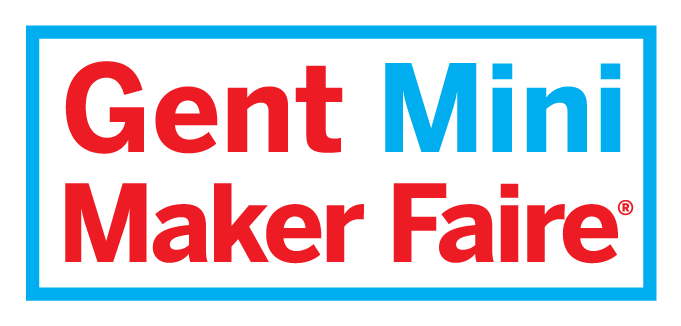

# Presentation

For the course of Projectwerk 2, there will be no final presentation or demonstration in the classical form. Instead, we have submitted the project for the [Maker Faire Gent](https://www.makerfairegent.be/). At this moment we do not have any confirmation yet.

The Maker Faire Gent is organized on 3, 4 and 5 may. Instead of a normal presentation in front of the teachers, students must present the project to the visitors of the Maker Faire.

The practical arrangement will be announced later when more details about the project and the Maker Faire are known. Please make sure to reserve these dates in your agenda. Participation to the Maker Faire is mandatory for all students.