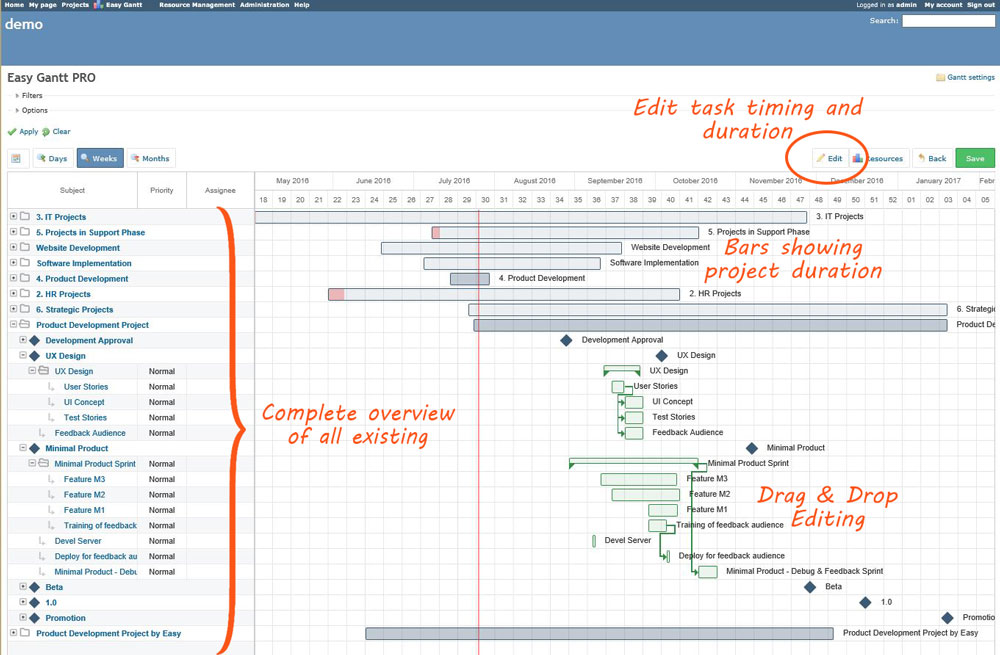

# Collaboration

The project could be subdivided in multiple major parts:

1. hardware
2. device drivers
3. firmware
4. database and database management system
5. visualization
6. docker
7. API
8. Documentation
9. ...

Each topic must be subdivided into smaller topics. _Each student_ should be engaged in _at least one_ of these major project parts. If the sub-project, in which you are involved, is finished, you should join your colleagues to support their design team. Developers can switch teams when priorities shift during the project. After all, the success of the global project depends on each cooperator!

To meet the objectives of the project, some requirements are mandatory:

* Define and accept only **SMART** objectives 
  * Specific 
  * Measurable
  * Acceptable 
  * Realistic 
  * Time Bound
* Plan Ahead, Plan wise. Therefore a Project Management System is the ideal support tool to enable this task. The project will be managed by **Redmine**.
* Efficient distribution and follow-up of tasks within the design team
* Agile **SCRUM** Software Development Methodology
* Efficient and streamlined communication between team members, peer-to-peer, bottom-up and top-down
* Peer assessment

## Agile Development SCRUM Methodology

The team of hardware developers should meet/communicate on a regular basis with the software development team. The use of the iterative and incremental Agile software development methodology of **SCRUM** \(see **image below**\) is mandatory. One of the major contributors to the successful realization of a project is an intense, regular communication between the hardware and the software engineering teams. Detailed agreements on interfaces, connectors, communication protocols, pinout, ... are mandatory and fundamental to guarantee the successful realization of your project within a realistic period of time.

## Git

All code and progress should be managed using Git. [github.com](https://github.com) can be used to create repositories and organize collaboration. Teachers should have full access to the projects, and projects should be public.

An GitHub organization [vives-projectwerk2-2019](https://github.com/vives-projectwerk2-2019) is provided for managing all the code projects. You have full access to this organization. Create, edit, build, do whatever you need in this organization. 

Make sure all projects are placed inside [vives-projectwerk2-2019](https://github.com/vives-projectwerk2-2019) organisation. Do not use personal accounts or other organizations to manage your code projects.

Note: Even failed experiments or code not used in the end result must be stored in Git repositories. **Code that has not been committed, is code that never existed. Ever!.**. Commits can be reverted, test code can be stored inside separate branches. You can even fork the project to experiment. There are multiple options.

## Redmine

URL: [http://project.devbit.be/](http://project.devbit.be/ "Redmine - Project Management System")

> **Redmine** is a flexible project management web application. Written using the Ruby on Rails framework, it is cross-platform and cross-database.

During this first session, a detailed planning must be made for the full length of time for the project. Each member must have at least one task assigned to himself at any moment during the development of the project.

At the end of each project day an evaluation will be made for each group based on the planning and logs of Redmine. Fine-tuning of the planning will be needed as the project advances to create a realistic picture of the progress and current state of the project.

> If it's not in the logs, it never happened !

## Slack

A slack channel "bug" is created for this project. Preferable all communication and discussions should be done here if it does not concern to Redmine.

[https://eo-ict-vives.slack.com/messages/bug/](https://eo-ict-vives.slack.com/messages/bug/)