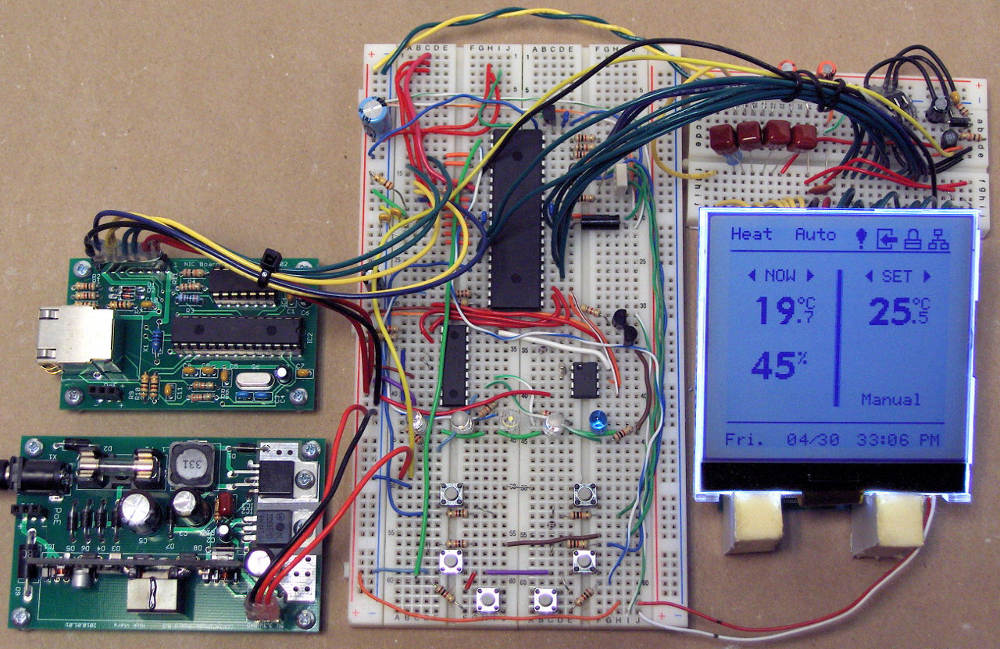
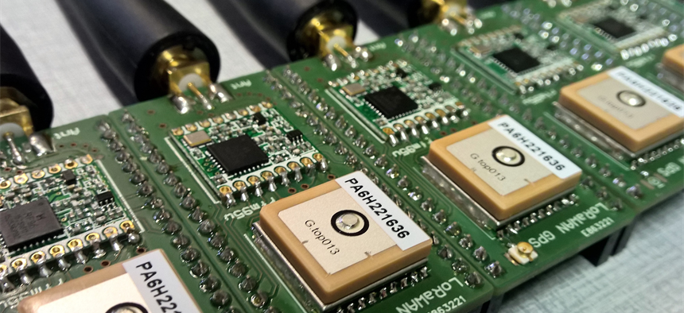

# Hardware requirements

The non-limited list of tasks of the hardware designers consists of the:

* development of a prototype using a processor and sensor boards;
* development of a custom battery powered PCB;

## Prototype

In an early stage, a fast proof-of-concept must be build using a prototype design. This design can be build using existing processor boards, breakout sensor boards and other pre-made hardware. This design will serve as a platform to test and develop firmware. In the next stage, a custom PCB with all the components must be build.

### Nucleo L476RG

TODO 

## Custom PCB

In the next stage, a custom PCB must be build using only the essential components. The PCB must also make use of battery power to operate, and must be optimized to run as long as possible. PCB's can be ordered online using a service like http://www.allpcb.com/ or an alternative service.

The PCB can be designed using the design software of your preference. We recommend [CircuitMaker](https://circuitmaker.com/), but [Eagle](https://www.autodesk.com/products/eagle/overview) is also a good option.

